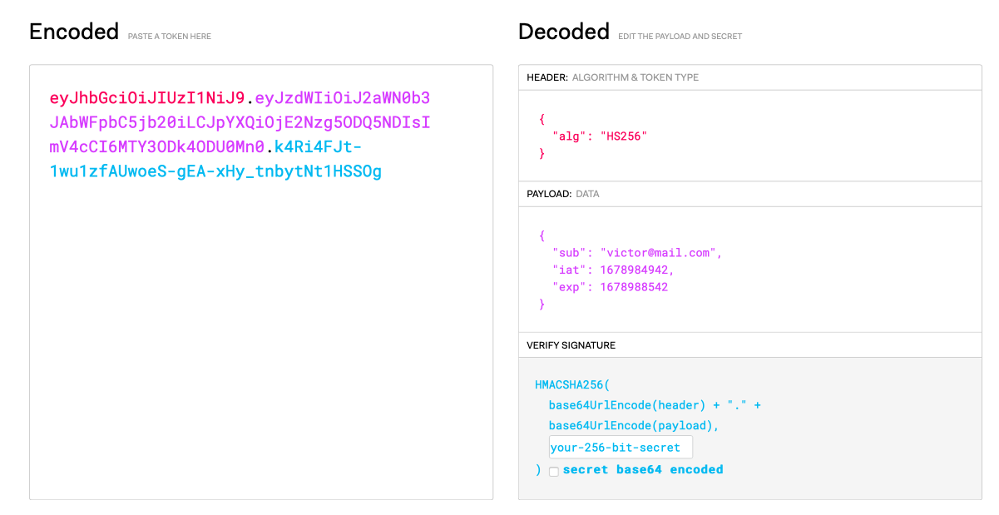

# Login System

This project is a API built using Spring that demonstrates my proficiency in creating Security services with Java. The API is designed to create and login in account uses JWT for authentication.

## Steps

1. [Create Account](#1-create-account)
2. [Send Confirmation Email](#2-send-confirmation-email)
3. [Confirm Account](#3-confirm-account)
4. [Login](#4-login)
5. [Generate JWT](#5-generate-jwt)
6. [JWT Authentication](#6-jwt-authentication)
7. [Login History](#7-login-history)
8. [Logout](#8-logout)


## Docs

- [Swagger](https://api-login.victorborzaquel.com/swagger-ui/index.html)
- [Sonar](https://sonarcloud.io/project/overview?id=victorborzaquel_login-bancario)
- [Postman](https://www.postman.com/victorborzaquel/workspace/portifolio/)
- [Aplication URL](https://api-login.victorborzaquel.com)

## Technologies

- Java 17
- Spring Boot
- Spring Security
- Spring Data JPA
- Spring Mail
- Spring Validation
- Spring Test
- PostgreSQL
- JWT
- Lombok
- Flyway

### 1. Create Account

First step is create an account, for that is necessary send a post request to `/api/v1/auth/register` with the following body:

```json
{
    "email": "User email",
    "password": "User password"
}
```
The API use Spring Validation for validate the request body. If the request body is invalid, the API return a 400 Bad Request. If the request body is valid, the API create the account and send a confirmation email to the user.

### 2. Send Confirmation Email

Confirmation token is a UUID generated by the API and saved in the database. The API send email the user with a link to confirm the account.

### 3. Confirm Account

User click in the link in the email, the account is confirmed. The API save the confirmation date in the database. If the user click in the link after 10 minutes after the token is generated, the API return a 400 Bad Request and required generate a new token.

### 4. Login

After the account is confirmed, the user can login. For that is necessary send a post request to `/api/v1/auth/login` with the following body:

```json
{
    "email": "User email",
    "password": "User password"
}
```

### 5. Generate JWT

When the user login, the API generate a JWT token. The token is saved in the database and is used for authentication in the other endpoints.

JWT (JSON Web Token) is an encoded as a JSON object that is digitally signed. JWTs can be signed using a secret (with the HMAC algorithm) or a public/private key pair using RSA.

Example of a JWT token:


### 6. JWT Authentication

The token is valid for 1 hour. After 1 hour, the token is expired from the database and the user need to login again. If the user login another time, the API revoke the previous token and generate a new token.

### 7. Login History

The API save in databese the login history of the user. Is excenlent for security, because the user can see the login history and check if the account was compromised.

### 8. Logout

The user can logout from the API. For that is necessary send a post request to `/api/v1/auth/logout` with the JWT Token in the header. The API revoke the token and the user need to login again.
